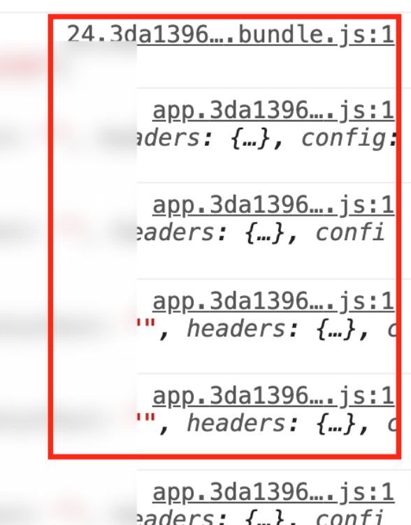
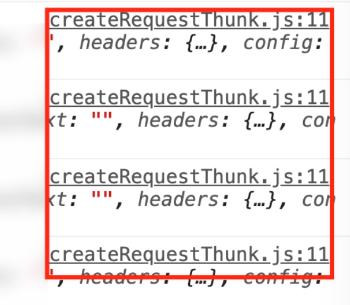

# [React] 환경설정 제대로 알고 하기 (without CRA) ②

> 지난 포스팅에서는 CRA 없이 React 기반 환경설정을 하기 위해 필요한 기본 라이브러리와 Babel을 설정해 보았습니다.
> 이번 포스팅에서는 webpack 설정을 개발/배포로 나눠서 하는 방법을 설명하려고 합니다.

## 목차

1. [webpack config와 scripts 설정](#1-webpack-config와-scripts-설정)
2. [기본 라이브러리 설치](#2-development-모드-환경설정)
3. [production 모드 환경설정](#3-production-모드-환경설정)
4. [공통 환경설정 및 webpack merge](#4-공통-환경설정-및-webpack-merge)

## 1. webpack config와 scripts 설정

> 이제 `webpack.config.js` 파일을 생성해 Webpack 실행 규칙을 작성하면 됩니다.
> 이 포스팅에서는 package.json의 scripts를 사용해 `develop/product` 모드를 나누어 다른 config 파일을 실행시키려고 합니다.

### scripts로 dev/prod 모드 나눠서 실행시키기

```jsx
  "scripts": {
    "start": "webpack-dev-server --env=dev",
    "build": "rm -rf dist/ && webpack --env=prod"
  },
```

### start

- `--env=dev`로 webpack.dev.js를 webpack-dev-server로 실행합니다.

### build

- dist 폴더를 삭제하고 `--env=prod`로 webpack.prod.js를 webpack으로 실행합니다.

### webpack.config.js 로 다른 모드 실행

```jsx
module.exports = function (env) {
  return require(`./webpack.${env}.js`);
};
```

- `--env`키워드를 지정해 webpack config파일을 실행할 때 다른 버전의 설정 파일을 require하여 실행하게 할 수 있습니다.
- 위와 같이 **dev와 prod**를 env로 지정한다면 webpack.dev.js와 webpack.prod.js 파일을 만들어 다른 내용을 작성하면 됩니다.

## 2. development 모드 환경설정

> development 모드에서는 개발 서버를 띄우고 계속해서 변경 사항을 확인해야 하기 때문에 그에 맞는 설정이 필요합니다.

### mode

`development 모드`로 실행하면 속도와 개발자 경험에 최적화되어 실행됩니다.

```jsx
mode: "development",
```

### devtool

```jsx
devtool: "cheap-module-source-map",
```

webpack 설정을 통해 빌드하게 되면 코드가 난독화되고 최소 용량을 가지기 위해 개행 등의 문자들이 사라져 읽기가 어려워 집니다.

개발 중에 디버깅 하기에도 문제가 있습니다. 에러 로그 등을 볼 때 번들 파일의 1번째 줄을 가리키고 있어서 어느 부분에서 발생한 것인지 보기 힘듭니다.



이를 해결하기 위해 devtool의 source map 설정으로 원래 파일과 동일한 파일명과 라인으로 로그를 보여주게 할 수 있습니다.

devtool에서 설정할 수 있는 source map 설정은 방대하기 때문에 이 포스팅에서 모두 설명하지는 않습니다.

여기서 설정한 devtool은 `cheap-module-source-map` 입니다. 용량이 작게 번들링되는 옵션이어서 선택했는데, 개발용에서 쓰이니 `inline-source-map` 설정도 고려할 수 있습니다.



### devServer

`devServer` 옵션은 webpack-dev-server가 다양한 방식으로 동작되도록 변경하는 데 사용할 수 있습니다.

webpack-dev-server: localhost로 접속되는 개발 서버입니다.

아래를 통해 주요 옵션과 사용한 옵션에 대해 설명하도록 하겠습니다.

```jsx
	devServer: {
    historyApiFallback: true,
    inline: true,
    port: 3000,
    hot: true,
    open: true,
    publicPath: "/",
  },
```

1. `contentBase`: output을 설정한 경우 output이 있는 디랙토리로 path를 지정해 개발 서버를 실행시킬 수 있게 합니다.
2. `port`: 개발 서버를 어떤 포트로 실행할지 지정하는 옵션입니다. 따로 지정하지 않으면 자동으로 8080포트로 실행됩니다.
3. `historyApiFallback`: SPA에서 history API를 사용해 주소가 변경되는 것을 저장하려고 할 때 쓰입니다.
4. `inline, hot`: 재로딩 전이나 에러 발생 전, 그리고 Hot Module Replacement 활성화가 되었을 때 콘솔로 로그를 보여주게 하는 옵션입니다.
5. `open` : localhost로 서버가 띄워 지면서 브라우저 창도 자동으로 열어 주는 옵션입니다.
6. `publicPath`: 시작하는 public 파일의 주소가 어디에 있는지 설정할 수 있습니다.

### plugins

plugins에 사용하는 플러그인을 설정할 수 있습니다.

- `Dotenv`: 개발 모드에서는 환경변수 파일을 지정해 주는 `dotenv-webpack`을 사용해 개발용 환경변수 파일을 지정을 하고 `process.env.{환경변수 이름}` 와 같은 형태로 사용할 수 있습니다. env는 토큰과 같이 보호해야 하는 값을 사용할 때 설정합니다.
- `HotModuleReplacementPlugin`: 웹팩에 내장된 플러그인입니다. 내부 코드 변화 시 이를 감지하여 자동으로 업데이트가 되게 합니다.

```jsx
	plugins: [
    new Dotenv({
      path: path.resolve(__dirname, "./.env.development"),
    }),
	  new webpack.HotModuleReplacementPlugin(),
  ],
```

## 3. production 모드 환경설정

> webpack에서 프로덕션 모드는 기본적으로 애플리케이션을 배포와 관련된 유용한 집합을 제공합니다. 배포할 때 최적화를 어떻게 진행할 수 있는지 살펴보겠습니다.

### mode

`production 모드`로 실행하면 배포와 관련된 최적화를 실행됩니다.

```jsx
mode: "production",
```

### output

개발하는 웹페이지에서 파일이 1개로 유지되면 좋겠지만, 페이지, 컴포넌트가 많아지면서 파일이 수십 개가 넘어갑니다.

그래서 배포할 때는 파일을 특정 기준에 맞게 번들 파일로 압축하여 파일의 개수를 줄입니다. 이를 output option을 설정하여 진행할 수 있습니다.

```jsx
output: {
  chunkFilename: "[name].[hash].bundle.js",
  path: path.resolve(__dirname, "dist"),
  publicPath: "/",
},
```

1. `chunkFilename`: 번들 설정으로 나눠지는 파일들의 이름을 설정합니다.
   - [name]: 해당하는 파일의 이름이 적혀집니다.
   - [hash]: 웹팩이 빌드될 때마다 다른 고유값이 설정돼 빌드 파일이 바뀔 경우 이전 캐싱 파일을 또 쓰게 되지 않게 됩니다.
2. `path`: 번들 파일들이 저장될 경로를 지정해야 합니다. 저는 dist 폴더에 저장되도록 지정했습니다.
3. `publicPath`: 브라우저에서 참조될 때 출력 파일의 공용 URL 주소를 지정합니다.

### optimization

너무 큰 번들 파일은 초기 로딩 속도 지연의 원인이 될 수 있습니다. 그래서 optimization 옵션으로 chunk를 나누어서 번들 파일로 만들 수 있습니다.

`splitChunks`: 다른 번들 파일에서 중복으로 들어가는 코드를 공통 영역으로 만들어 주는 옵션입니다. 아래와 같이 사용할 수 있습니다.

```jsx
optimization: {
  splitChunks: {
    name: "vendor",
    chunks: "initial"
  }
}
```

cacheGroups으로 chunk 나누기

- minSize와 maxSize를 설정하여 해당 사이즈보다 크면 코드를 나누어 빌드합니다.

```jsx
optimization: {
    splitChunks: {
      cacheGroups: {
        commons: {
          test: /[\\/]node_modules[\\/]/,
          name: "vendors",
          chunks: "all",
          minSize: 10000,
          maxSize: 250000,
        },
      },
    },
  },
```

#### optiomization 적용 전


#### optiomization 적용 후


## 4. 공통 환경설정 및 webpack merge

> 공통 환경설정에는 dev와 prod 모두에 적용되는 설정들이 있습니다.
> 공통 환경설정을 webpack merge 라이브러리를 사용해 위의 설정들과 합쳐서 사용하는 방법을 알아보겠습니다.

### entry

진입 파일을 설정합니다.

여기서 폴리필과 index 파일을 배열로 넣었습니다. 폴리필은 async, await과 같은 문법을 사용할 때 js 파일에서 하나씩 import하여 쓰지 않고 바로 쓸 수 있게끔 하기 위해 넣습니다. index 파일은 프로젝트에서 가장 루트 파일입니다.

```jsx
entry: {
  app: ["babel-polyfill", "./src/index.jsx"],
},
```

### module

리액트 앱에서 사용하는 다양한 파일들을 로드시키기 위한 모듈 설정이 필요합니다. rules에 배열로 필요한 룰을 지정하여 설정할 수 있습니다.

- `babel-loader`: js 또는 jsx 파일을 로드시키기 위해 필요합니다. loader를 babel-loader로 설정하고, preset에 babel/preset-env를 설정하여 로드되게 할 수 있습니다.
- `file-loader`: 사진 파일이나 svg 파일을 로드시킬 때 사용할 수 있습니다. option에 이름을 설정하면 output될 때 해당하는 이름으로 설정됩니다.

```jsx
module: {
  rules: [
    {
      test: /\.jsx?$/,
      loader: "babel-loader",
      options: {
        presets: ["@babel/preset-env"],
      },
      exclude: /node_modules/,
    },
    {
      test: /\.(jpg|png)$/,
      loader: "file-loader",
      options: {
        name: "[name].[ext]?[hash]",
      },
    },
  ],
},
```

### resolve

resolve에서 alias를 설정해 절대 경로를 사용할 수 있습니다.

- `extensions`: alias를 지정할 확장자명을 배열로 지정합니다.
- `alias`: key값에 절대경로명, value값에 해당하는 폴더명을 넣어 alias를 지정합니다.

추가로, 절대경로가 VSCode에서 자동완성이 되게 하기 위해서는 jsconfig (ts 환경에서는 tsconfig)에서 `path` 를 아래와 비슷한 형식으로 지정해야 합니다.

```jsx
resolve: {
  extensions: [".js", ".jsx"],
  alias: {
    "@": path.resolve(__dirname, "src/"),
  },
},
```

### plugins

- `HtmlWebpackPlugin`: 번들로 만들어진 js 파일을 html에 script 태그에 추가시켜야 합니다. 이를 자동화 시켜주는 플러그인입니다. `filename`에는 자동으로 생성할 파일 이름, `template`에는 현재 있는 파일로 filename의 기반 코드입니다.
- `CleanWebpackPlugin` : 이전에 만들었던 번들을 지워 주는 플러그인입니다.

```jsx
plugins: [
  new HtmlWebpackPlugin({
    filename: "index.html",
    template: "public/index.html",
  }),
  new CleanWebpackPlugin(),
],
```

### webpack merge

- 위와 같이 만든 common 설정을 webpack merge를 통해 공통적으로 사용할 수 있습니다.

```
npm i -D webpack-merge
```

- 설치한 후 `merge(common, { 추가적인 옵션 })` 형태로 사용할 수 있습니다.

# 최종 환경 설정

- [https://github.com/choisohyun/my-react-boilerplate/tree/react-basic](https://github.com/choisohyun/my-react-boilerplate/tree/react-basic)

## 참고2

[https://sujinlee.me/webpack-react-tutorial/](https://sujinlee.me/webpack-react-tutorial/)

[https://perfectacle.github.io/2016/11/14/Webpack-devtool-option-Performance/](https://perfectacle.github.io/2016/11/14/Webpack-devtool-option-Performance/)
