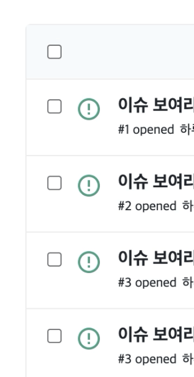

# [React] Checkbox 상태관리하기

> 이번 포스팅에서는 React에서 체크박스 UI 를 만들고 컴포넌트 간 상태관리를 하는 방법을 예제와 함께 설명할 예정입니다.

## 개요

1. Checkbox UI 만들기
2. Checkbox 하나 선택 상태관리
3. Checkbox 전체선택 상태관리
4. 요약 및 추가 사항

> 참고: 예제 코드 환경은 React, styled-component를 주로 하며, 스타일 코드는 생략되어 있습니다.
> 스타일 코드를 포함한 전체 프로젝트 코드는 [여기](https://github.com/codesquad-member-2020/issue-tracker-08/blob/dev/FE/src/views/IssueListPage/IssueListPage.jsx)에서 보실 수 있습니다.

## 1. Checkbox UI 만들기

- Checkbox는 html의 input 태그에 타입을 체크박스로 지정해 만들 수 있습니다.
- 체크박스만 만든다면 아래와 같이 작성 가능합니다.

```jsx
<input type="checkbox" />
```

우리는 리스트와 전체선택에 체크박스를 모두 포함시켜야 합니다. 여러 개의 요소에 모두 체크박스를 붙이기 위해 map을 활용하면 됩니다.

- 우선 체크박스 하나를 포함한 하나의 컴포넌트를 `Issue`라고 생성합니다.

```jsx
const Issue = () => {
  return (
    <Wrapper>
      <input type="checkbox" />
    </Wrapper>
  );
};
```

- Issue 컴포넌트를 가지고 IssueList 컴포넌트를 생성해 체크박스를 리스트로 불러옵니다.
- 지금은 실제 데이터를 사용하는 것이 아니기 때문에 임의로 배열을 생성해 map을 돌려 이슈리스트를 만듭니다.
- 체크박스 전체선택을 위한 input도 추가합니다.

```jsx
const IssueList = () => {
  const issues = [...Array(10).keys()]; // [0, 1, 2, 3, 4, 5, 6, 7, 8, 9]

  return (
    <>
      <Header>
        <input type="checkbox" />
      </Header>
      <List>
        {issues.map((issue, index) => (
          <Issue key={index} />
        ))}
      </List>
    </>
  );
};
```

- UI 구성과 추가적인 스타일 처리가 진행되면 아래와 같은 화면을 만들 수 있습니다.
- 이제 다음으로 넘어가 상태관리에 대해 얘기해 보겠습니다.



## 2. Checkbox 하나 선택 상태관리

> 체크박스를 `상태관리`를 한다는 것은 전체 리스트에서 체크된 요소가 어떤 것인지 알아야 한다는 의미입니다.
> 우선 리스트의 요소를 하나씩 선택할 때의 상태관리를 진행해 보겠습니다

먼저 체크박스 리스트의 속성을 보겠습니다. 체크박스를 연속적으로 클릭하게 되면 해제/선택을 반복합니다.

그렇다면 선택된 요소들은 Set에 저장해야 중복되는 요소 없이 저장할 수 있겠습니다. 일반 배열을 사용한다면 같은 요소 해제/선택을 반복하게 되면 중복값이 들어가게 될 수 있기 때문입니다.

- 우선 위의 **IssueList 컴포넌트**에서 useState로 `빈 Set`이 초기값인 상태를 만듭니다.

```jsx
// IssueList 컴포넌트

const [checkedItems, setCheckedItems] = useState(new Set());
```

- 그리고 이를 사용해 하나의 요소를 선택할 때의 상태관리 함수 `checkedItemHandler`를 작성합니다.
  - Set을 사용할 때는 불변성을 유지시키기 위해 메소드 실행 후 setCheckedItems를 진행합니다.
- 체크됐을 경우, 요소를 Set에 추가되도록 `setCheckedItems`를 활용해 `add`시킵니다.
- 체크되지 않았을 경우, 선택됐던 것이 해제된 것이라면 `checkItems`에서 `delete`합니다.

```jsx
// IssueList 컴포넌트

const checkedItemHandler = (id, isChecked) => {
  if (isChecked) {
    checkedItems.add(id);
    setCheckedItems(checkedItems);
  } else if (!isChecked && checkedItems.has(id)) {
    checkedItems.delete(id);
    setCheckedItems(checkedItems);
  }
};
```

- `checkedItemHandler` 를 Issue 컴포넌트에 props로 전달합니다.
- 체크박스는 `onChange`를 통해 체크 여부를 체크 클릭 시마다 boolean 값으로 알 수 있습니다.
- `checkHandler`를 생성해 input의 onChange로 등록시킵니다.
- input 태그는 `checked` 속성으로 체크를 바꿀 수 있기 때문에 Issue에도 useState를 사용해 상태를 저장하고 checked에 등록합니다.

```jsx
// Issue 컴포넌트

const [bChecked, setChecked] = useState(false);

const checkHandler = ({ target }) => {
  setChecked(!bChecked);
  checkedItemHandler(issue.id, target.checked);
};

// 컴포넌트 쌓여진 부분 생략
<input type="checkbox" checked={bChecked} onChange={(e) => checkHandler(e)} />;
```

## 3. Checkbox 전체선택 상태관리

> 전체 선택은 하나씩 선택할 때보다 상태관리가 조금 더 복잡합니다.
> 어떻게 할 수 있는지 알아보겠습니다.

- 먼저 2번에서 생성한 바와 같이 useState로 전체선택에 대한 상태값을 생성합니다.
- 그리고 이번엔 allCheckedHandler에 체크 여부에 따라 분기 처리를 진행합니다.
  - 체크됐을 경우, `새로운 Set`에 이슈의 모든 id 값을 넣고 isAllChecked를 `true`로 변경시킵니다.
  - 체크되지 않았을 경우, Set을 `clear` 메소드를 통해 비우고 isAllChecked를 `false`로 변경시킵니다.

```jsx
// IssueList 컴포넌트

const [isAllChecked, setIsAllChecked] = useState(false);

const allCheckedHandler = (isChecked) => {
  if (isChecked) {
    setCheckedItems(new Set(issues.map(({ id }) => id)));
    setIsAllChecked(true);
  } else {
    checkedItems.clear();
    setCheckedItems(setCheckedItems);
    setIsAllChecked(false);
  }
};
```

- Issue 컴포넌트에서는 위에서 isAllChecked 상태를 받아 체크 여부를 받습니다.
- 위에서는 단순 상태값과 Set에 담긴 데이터만 변경되었고 화면에는 변경 사항이 없기 때문에 Issue에서 변경시켜야 합니다.
- 2번에서 생성한 `const [bChecked, setChecked] = useState(false);`를 더 활용할 수 있게 되었습니다.
  `useEffect`로 isAllChecked이 변경되면 `allCheckHandler`를 실행시켜 bChecked 상태값이 바뀌도록 말입니다.

      위에서 input 태그에 이미 checked를 적용시켰기 때문에 bChecked가 바뀌면 일괄 적용됩니다.

```jsx
// Issue

const allCheckHandler = () => setChecked(isAllChecked);

useEffect(() => allCheckHandler(), [isAllChecked]);
```

- 마지막으로 전체선택을 할 때도 체크되는 것이 바뀌면서 보여져야 하기 때문에 Issue에서 사용한 상태를 동일하게 적용해 줍니다. 코드가 동일해 포스팅에 포함하지는 않습니다.

### 결과

- UI 변화도 빠르게 잘 되고 콘솔로 찍었을 때에도 Set에 잘 담기는 것을 볼 수 있습니다.


## 결론

- 프로젝트를 하면서 만들었던 체크박스 상태관리 기능을 정리해 보았습니다. 만드는 과정에서 UI 변화가 잘 안 된다거나 중복값이 계속 담기는 오류가 있었기 때문에 성공한 것으로 정리했습니다.
- 동작은 하지만 뭔가 상태관리를 위해 부모와 자식 모두에서 선언이 필요하고 복잡해 보입니다. 이를 해결하는 방법에 대해서는 추가적으로 [LINE 기술 블로그의 React 컴포넌트를 커스텀 훅으로 제공하기](https://engineering.linecorp.com/ko/blog/line-securities-frontend-3/) 글에서 다루고 있으니 참고해 주세요.
