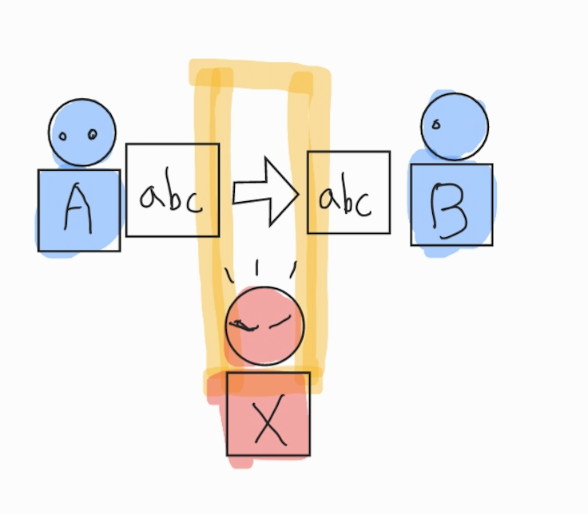

# 데이터 전달 시 발생할 수 있는 문제들

## 개요

인터넷을 통해 데이터를 전달할 때 데이터는 **다양한 네트워크나 장비를 경유**한다.

이 때 누군가가 나쁜 의도를 가지고 데이터를 조작한다면 해당 데이터가 악용될 수 있다.

따라서 이를 인터넷을 안전하게 사용하기 위해서는 그에 따른 보안 기술이 필요하다.

그렇다면, 데이터 전달 시 발생할 수 있는 대표적인 4가지 문제에 대해 알아보자.

## 데이터 전달 시의 네 가지 문제점


### 1. 도청

A가 B에게 데이터를 전달할 때, 중간에 X가 메시지를 훔쳐 볼 수 있다. 이를 `도청`이라 한다.

도청을 대처하기 위해서는 `암호화`가 사용된다.



### 2. 위장

X가 A인 척하여 B에게 데이터를 보내거나, 또는 X가 B인 척하며 A로부터 데이터를 받을 수 있다. 이를 `위장`이라 한다.


위장을 대처하기 위해서 `메시지 인증 코드`와 `전자 서명` 방법이 사용된다.

```
* 메시지 인증 코드  

암호화된 데이터라도 중간에 복호화를 거쳐 변조될 수 있다. 이러한 변조 여부를 검증할 수 있도록 데이터에 덧붙이는 코드를 `메시지 인증 코드`라고 한다.

* 전자 서명

메시지 인증 코드에 부인 방지를 추가한 것.
```
### 3. 변조

A가 B에게 데이터를 전달할 때, 중간에 X가 데이터를 가로채어 내용을 변경할 수 있다. 이를 `변조`라 한다.
제 삼자가 의도적으로 변조한 것 외에도 통신상의 문제로 인해 데이터가 망가질 수 도 있다.


변조에 대처하기 위해서는 마찬가지로 `메시지 인증 코드`와 `전자 서명` 방법이 사용된다.

### 4. 사후 부인

A가 B에게 데이터를 전달한 후, 전송자인 A가 악의를 가지고 자신이 보내지 않았다고 부정할 수 있다. 이 경우 인터넷상의 상거래나 계약 행위 등이 성립하지 않게 된다. 이를 `사후 부인`이라 한다. 


사후 부인을 대처하기 위해서는 `전자 서명`이 사용된다.

---

|문제|해결방법|
|---|---|
|도청|암호화|
|위장|메시지 인증 코드 / 전자 서명|
|변조|메시지 인증 코드 / 전자 서명|
|사후 부인|전자 서명|

---

참고

도서 : 알고리즘 도감 - 제이펍